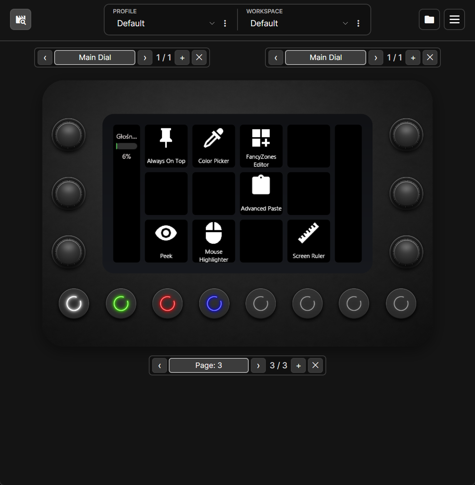
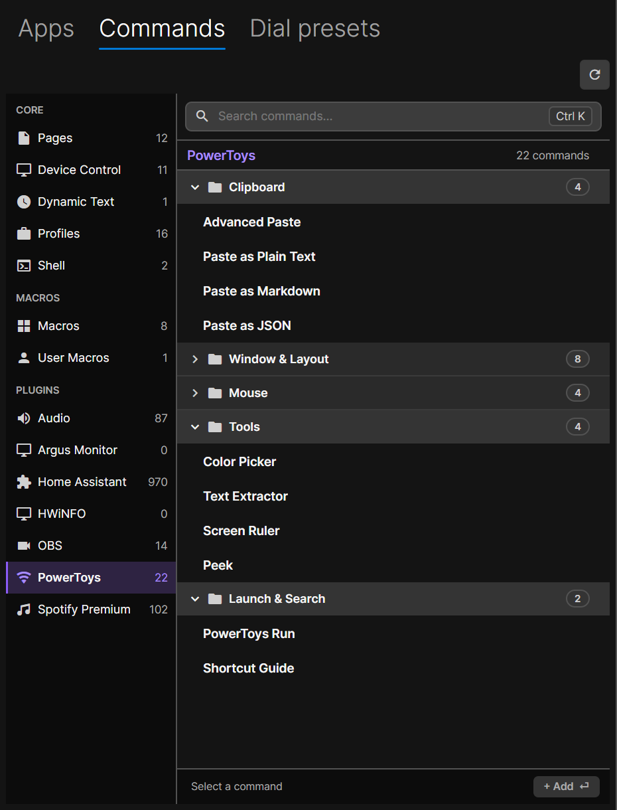

# PowerToys for LoupixDeck

Control Microsoft PowerToys from [LoupixDeck](https://github.com/RadiatorTwo/LoupixDeck) using the shortcuts configured in PowerToys. Version 0.2.1 provides 22 actions.

  

## Actions

The command picker groups 22 `PowerToys` actions into category folders under Plugins:

  

- Advanced Paste
- Paste as Plain Text
- Paste as Markdown
- Paste as JSON
- Always On Top
- Increase Opacity
- Decrease Opacity
- FancyZones Editor
- Crop and Lock Thumbnail
- Crop and Lock Reparent
- Crop and Lock Screenshot
- Workspaces
- Mouse Highlighter
- Mouse Jump
- Mouse Pointer Crosshairs
- Cursor Wrap
- Color Picker
- Text Extractor
- Screen Ruler
- Peek
- PowerToys Run
- Shortcut Guide

## Requirements

- Windows with LoupixDeck and Microsoft PowerToys installed.
- A LoupixDeck Plugin SDK compatible with version 1.26.0.

## Installation

Download `powertoys-0.2.1-windows.zip` from the [GitHub Releases page](https://github.com/Vencite/LoupixDeck.Plugin.PowerToys/releases). In LoupixDeck, open the Plugins window and install the downloaded ZIP. Restart LoupixDeck if requested.

The release package is built by the official LoupixDeck Plugin SDK workflow. For a local build, follow [DEVELOPMENT.md](DEVELOPMENT.md).

## Use

Add a PowerToys action from the LoupixDeck command picker to a button. Button artwork uses LoupixDeck's standard layers, which you can edit in LoupixDeck. If an icon is absent, select it manually in the symbol picker. The plugin reads its current shortcut from PowerToys settings each time the button is pressed and sends it through LoupixDeck. You do not need to copy shortcuts into the plugin. Changes made in PowerToys take effect without restarting LoupixDeck. A missing or invalid shortcut is reported in the plugin log.

## Development

Build, validation and release instructions are in [DEVELOPMENT.md](DEVELOPMENT.md).

## License

Plugin code is available under the MIT License. See [LICENSE](LICENSE). MDI icon attribution is in [Assets/Mdi/NOTICE.md](Assets/Mdi/NOTICE.md).
